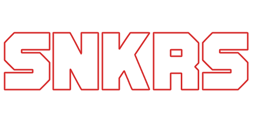

<!-- PROJECT LOGO -->
<br />
<div align="center">
  <a href="https://github.com/othneildrew/Best-README-Template">
    
  </a>

  <h3 align="center">Sobre el proyecto</h3>

  <p align="center">
    Pagina web "twitter style" enfocada al mundo de las zapatillas, de todo tipo, desde running hasta las denomindas "sneakers". Proyecto desarrollado como TFG para el CIFP Virgen de Gracia
  </p>
</div>

### Proyecto contruido con

Como tecnologias mas importantes se han usado:

* [Node.js](https://nodejs.org/es/)
* [Vue.js](https://vuejs.org/)
* [Bootstrap](https://getbootstrap.com)
* [MongoDB](https://www.mongodb.com)


## Despliegue

### Prerequisitos

Instalacion de npm
* npm
  ```sh
  npm install npm@latest -g
  ```

### Instalacion

1. Clonar el repositorio
   ```sh
   git clone https://github.com/IamUnder/SNKRS.git
   ```
2. Instalar las dependencias de NPM en las dos partas del proyecto
   ```sh
   cd backend
   npm install
   cd ../frontend
   npm install
   ```
3. Copiar el .env de modelo de la carpeta de backend y rellenarlo con nuestra configuracion
  
4. Si deseas disponer de la subida de archivos generar el fichero de keys en [Firebase](https://firebase.google.com) y copiarlo en la ruta backend/congif con el nombre de firevase.json
   ```js
   const API_KEY = 'ENTER YOUR API';
   ```

<p align="right">(<a href="#top">back to top</a>)</p>

## Uso de la aplicacion

Una vez desplegado el proyecto bastaria con crearse una cuenta de usuario y ya podriamos acceder a la aplicacion

_En caso de buscar mas informacion sobre el proyecto dirijase a la [Documentation](https://github.com/IamUnder/SNKRS/wiki)_

<p align="right">(<a href="#top">back to top</a>)</p>


